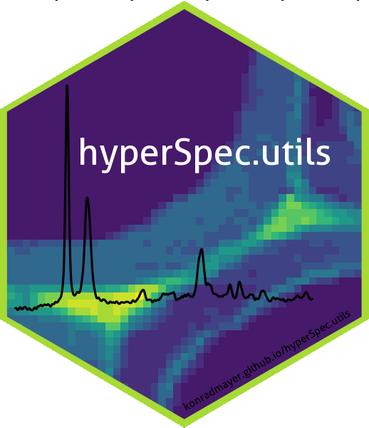
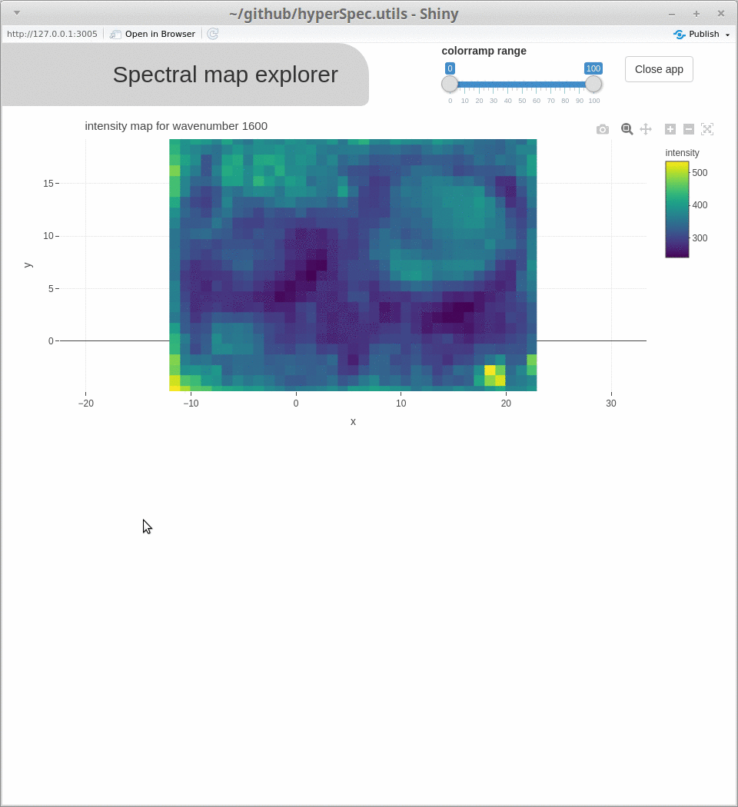
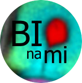

<!-- README.md is generated from README.Rmd. Please edit that file -->

```{r, include = FALSE}
knitr::opts_chunk$set(
  collapse = TRUE,
  comment = "#>",
  fig.path = "man/figures/README-",
  out.width = "100%"
)
```

# hyperSpec.utils 

<!-- badges: start -->
[](https://www.repostatus.org/#wip)
<!-- badges: end -->

This R package is a collection of utility functions to work with objects of the class `hyperSpec` as defined by the package [{hyperSpec}](https://cran.r-project.org/package=hyperSpec). While it is independent from the popular [{hyperSpec}](https://cran.r-project.org/package=hyperSpec) package (written by Claudia Beleites), `{hyperSpec.utils}` intends to add some convenient shortcuts for data analysis, some more conversion, import and export functions, tools for interactive data exploration, as well as some extended functionality (such as cosmic ray removal).
The package can be considered as work in progress and substantial (also backwards incompatible) changes are to be expected.

## Installation

You can install hyperSpec.utils from GitHub with:

```
# install.packages("remotes")
remotes::install_github("konradmayer/hyperSpec.utils")
```

Use the argument `dependencies = TRUE` to also install suggested dependencies, mainly needed for the function `spcmap_explorer()`, as well as individual plotting, import/export and conversion functions.

## What is yet to come? 
Multiple additional functions are currently planned and ideas are added to the [issues](https://github.com/konradmayer/hyperSpec.utils/issues) section with an [![label: enhancement][~enhancement]](https://github.com/konradmayer/hyperspec.utils/issues?q=label%3Aenhancement) label attached.


If you have more ideas for useful functions, please open an [issue](https://github.com/konradmayer/hyperSpec.utils/issues) with appropriate tag, or, even better, open a [pull request](https://github.com/konradmayer/hyperspec.utils/pulls) to propose your ideas on a possible implementation.

## What is included?
The package will get continuously extended and currently holds functions 


- for extended import and export (export to Witec ASCII graph format with `write.txt.Witec.Graph()` or to JCAMP-DX with `write_jdx()`, experimental import of OPUS binary files with `read_opus()`)
- for spectral unmixing (wrappers `als()` for MCR-ALS, `nmf()` for NMF and `ica()` for ICA)
- for doing mixture analysis (`omp()` for the orthogonal matching pursuit, and `linear_combination()` for fitting linear combinations of reference spectra)
- for interactive visualization (e.g. `spcmap_explorer()`, which is demonstrated below, and `cubeview()`)
- introducing additional functionality (`crr()` for cosmic ray removal as defined in and provided with [this publication](https://doi.org/10.1016/j.chemolab.2018.06.009) by Whitaker and Hayes 2018, a S4 method for `diff()` or extending the test functions of `{hyperSpec}` by the simple `is.hyperSpec()` and `is.hyperSpecMap()` for consistency with the respective `{base}` functions, returning a logical value in all cases)
- with focus on spatially resolved spectral data (spectral maps; such as `spcmap2array()` to get an array of the spectral hypercube, `spcmap_dim()`, `is_hyperSpecMap()` as well as most visualization functions)
- being convenient shortcuts for already existing functionality (e.g. for normalization `minmax_normalization()`, `snv_normalization()`, `vector_normalization()`, `area_normalization()` and `band_normalization()`, for band aggregation `aggregate_wl()` resp. integration `integrate_wl()` plotting with the viridis color scale `plotmap_viridis()`)

```{r, out.width="700px", fig.align='center', echo=FALSE}

```


[~enhancement]: https://img.shields.io/badge/-enhancement-84b6eb.svg

# Acknowledgments


<table>
 <tr>
    <td></td>
    <td>This package was developed at the  <a href="http://www.bionami.at/">BIONAMI</a> (biological materials at the nano and micro scale) group at the University of Natural Resources and Life Sciences, Vienna, Institute for Biophysics, with funding from the European community (ERC-consolidator grant SCATAPNUT 681885).</td>
 </tr>
</table>


