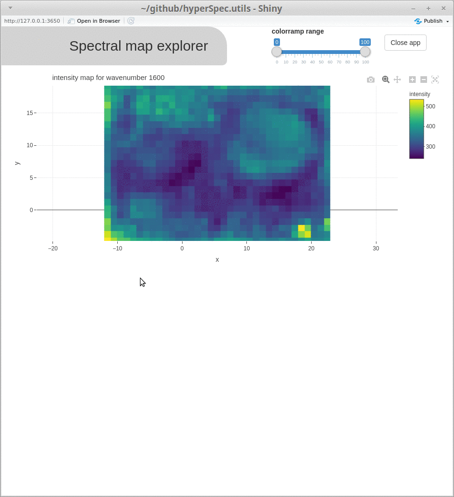
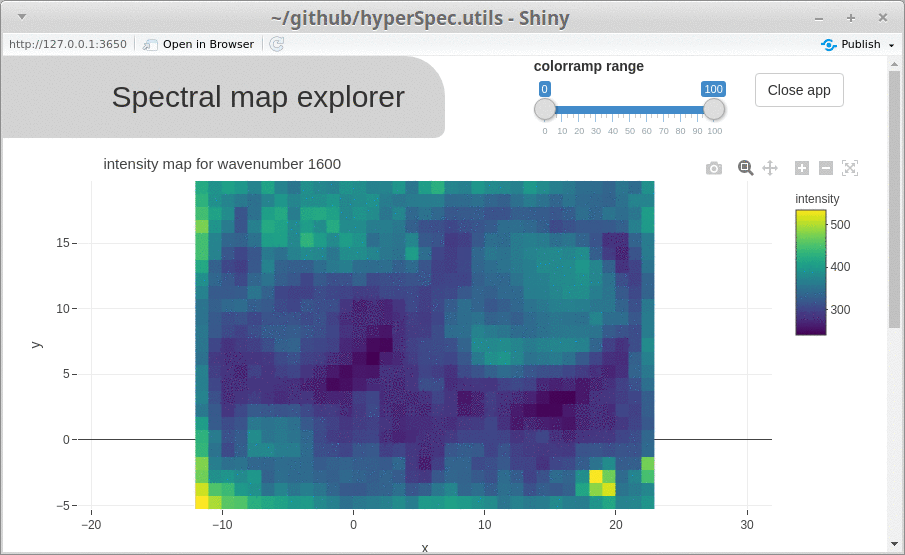
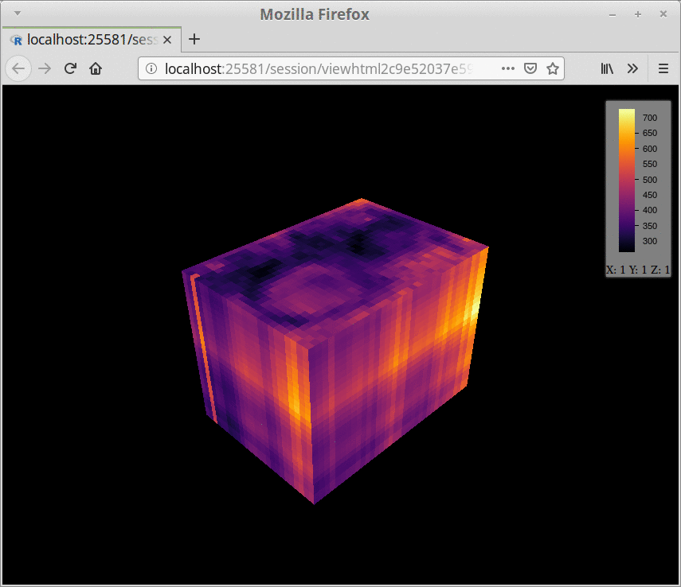

```{r, include = FALSE}
knitr::opts_chunk$set(
  collapse = TRUE,
  comment = "#>"
)
```

```{r setup, message=FALSE}
library(hyperSpec)
library(hyperSpec.utils)
```


# spcmap_explorer
`spcmap_explorer()` can be used to interactively visualize spatially resolved spectral data, to show the spectral map at a certain band and to show a spectrum at a specific pixel location. This way the (hypothetical) spectral hypercube is "sliced" into two very familiar 2D representations.

Start the app as follows:

```{r, eval=FALSE}
spcmap_explorer(chondro)
```

if you have high images it is probably convenient to flip x and y axis of the spectral map.

```{r, eval=FALSE}
spcmap_explorer(chondro, flip = TRUE)
```

## Zoom - select axis ranges

Use your mouse and select the area you want to zoom to by holding the left mouse button.
{ width=500px }


## fixed scale vs. autoscale

Using the defaults for the argument `fixed_y`, the y range is scaled to the the range of the complete dataset. Using `FALSE`, the function is started in autoscale mode, by providing a numeric vector the start range can be set manually for the spectum plot.

```{r, eval=FALSE}
spcmap_explorer(chondro, fixed_y = c(0, 1200))
```

If you want to compare intensities at multiple positions you likely want the y range to stay constant which is the case until you press the autoscale button. The y range is fixed again as soon as you select a new range interactively or pan the axis.

{ width=500px }

## alter color scale

Sometimes you are not interested in the variation over the intensity range of the complete dataset, but want to map a specific intensity range to the dynamic range of the color ramp to point out certain spatial variation. You can do that interactively, using the sliders in the title bar.

{ width=500px }

# cubeview

The function [`cubeview()`](https://github.com/r-spatial/cubeview) can be used to interactively explore a spectral hypercube. {hyperSpec.utils} provides a wrapper for the function to use it on hyperspec objects. 
Use the LEFT / RIGHT arrow keys and DOWN / UP arrow keys to set the slicing positions of the x-axis and y-axis, PAGE_DOWN / PAGE_UP keys for the z-axis. Press SPACE to show or hide guides. Use the left mouse-button to rotate, right mouse button to pan the hypercube. If you use the function inside RStudio, the Viewer pane may not display the cube. In that case, click on "Show in new window" to open it in a browser.

```{r, eval=FALSE}
cubeview(chondro[ , , 700~800])
```

{ width=500px }

In case you prefer the viridis color ramp you can specify it using the argument `col.regions`.

```{r, eval=FALSE}
cubeview(chondro[ , , 700~800], col.regions = viridis::viridis)
```

